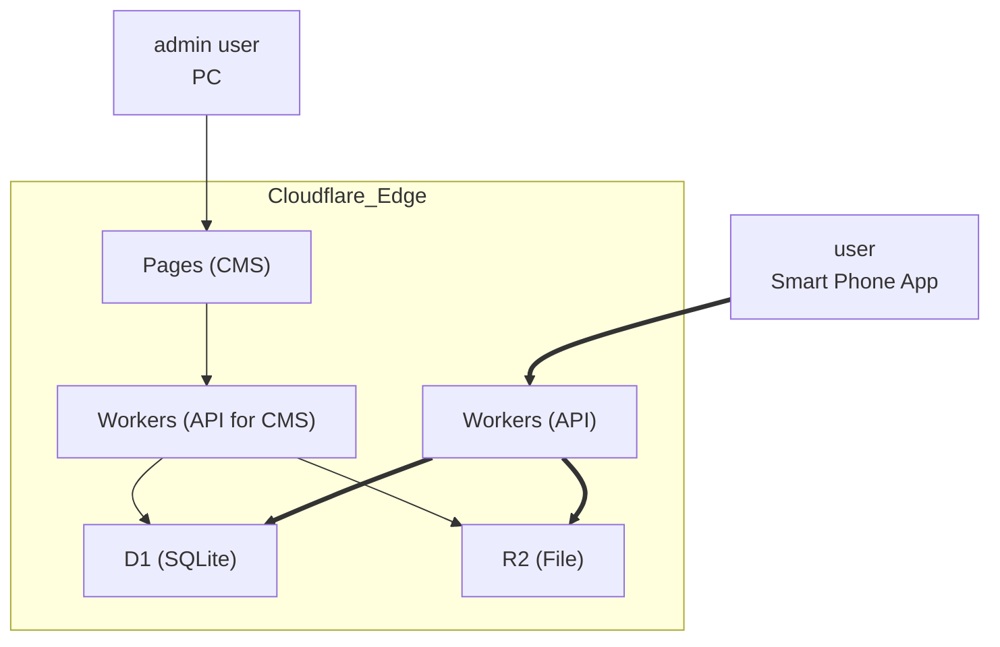

# Overview

DA 大相撲AR Project.

This is Monorepo using Turborepo as the management tool. Nextjs framework to run a React-Admin-based CMS. Hono framework to run the API.

## System diagram



💡Bold lines have a lot of access.

## Technology used

<!-- https://t8csp.csb.app/ -->

<p style="display: inline">
  
   
</p>

### CMS

<p style="display: inline">
  
  
  
  
  
</p>

### API

<p style="display: inline">
  
  
  
  
</p>

## Table of Contents

- [Environment Structure](#environment-structure)
- [Project structure](#project-structure)
- [Pre-installation](#pre-installation)
- [Installation(for Local)](#installationfor-local)
- [Installation(for Cloudflare)](#installationfor-cloudflare)

## Environment Structure

各環境ごとにCloudflare(CF)の Pages, D1, R2が別れている。

| Environment Name | Deploy Pipeline Branch | Who                 | CF Pages Project        | CF D1 DB Name          | CF R2 Bucket Name          |
| ---------------- | ---------------------- | ------------------- | ----------------------- | ---------------------- | -------------------------- |
| develop          | develop                | Miraiplay Developer | da-acsta-cms-develop    | da-acsta-db-develop    | da-acsta-bucket-develop    |
| staging          | staging                | Miraiplay Tester    | da-acsta-cms-staging    | da-acsta-db-staging    | da-acsta-bucket-staging    |
| stress           | stress                 | Miraiplay Developer | da-acsta-cms-stress     | da-acsta-db-stress     | da-acsta-bucket-stress     |
| qa               | qa                     | Outside QA Tester   | da-acsta-cms-qa         | da-acsta-db-qa         | da-acsta-bucket-qa         |
| production       | main                   | Digital Art         | da-acsta-cms-production | da-acsta-db-production | da-acsta-bucket-production |

## Project structure

See [project-structure.md](./docs/project-structure.md)

## Pre-installation

The following must be installed.

- [Nodes(v18 or higher)](https://nodejs.org/en/learn/getting-started/how-to-install-nodejs)
- [yarn](https://classic.yarnpkg.com/lang/en/docs/install/)
- [turborepo](https://turbo.build/repo/docs/getting-started/installation#global-installation)

## Installation(for Local)

### Install dependencies

```bash
yarn install
```

### Create `.env` file base on `.sample.env` of each `apps`

If the set value is not known, ask [Ishida](m.ishida@miraiplay.jp)/[Takahashi](takahashi@miraiplay.jp).

### Follow [README](./apps/cms/README.md) to setup local environment

### Run app in dev mode

```bash
yarn dev:cms
```

```bash
yarn dev:api
```

## Installation(for Cloudflare)

### Environment building

See [environment-building.md](./docs/environment-building.md)

### Migration DB & Seed DB

See [migration-db.md](./docs/migration-db.md)

### Deploy

See [deployment.md](./docs/deployment.md)
