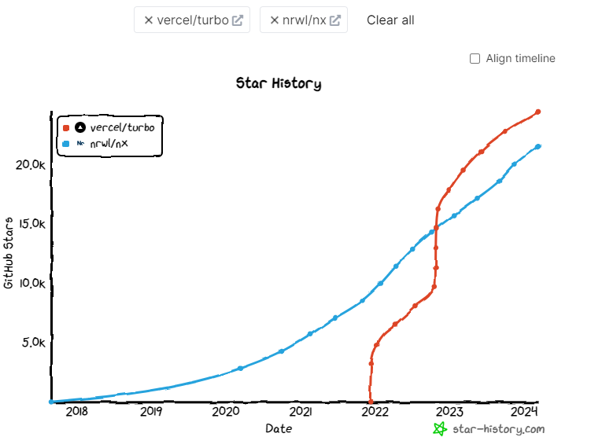

# Overview

- Nowaday, There are 2 stand-out monorepo management tool is [Turborepo](https://turbo.build/repo) an [Nx](https://nx.dev/)
- Bellow is brief summary comparison between these tools:

# Feature comparison

| Feature                      | Turborepo | Nx |
|:-----------------------------|:---------:|---:|
| Local caching                |     ✅     |  ✅ |
| Separated package.json       |     ✅     |  ❌ |
| Run Commands Across Projects |     ✅     |  ✅ |
| Shared Libraries             |     ✅     |  ✅ |
| Dependency Graph             |     ❌     |  ✅ |
| Incremental Builds           |     ✅     |  ✅ |
| Cloud Caching                |     ✅     |  ✅ |
| Distributed Task Execution   |     ❌     |  ✅ |

# Other criteria
| Criteria                                                         |                Turborepo                 |                                                              Nx |
|:-----------------------------------------------------------------|:----------------------------------------:|----------------------------------------------------------------:|
| Documentation quality                                            |                   ⭐⭐⭐⭐                   |                                                            ⭐⭐⭐⭐ |
| Easy migrate                                                     |                   ⭐⭐⭐⭐                   |                                                             ⭐⭐⭐ |
| Github star (March 2024)                                         | [24.4k](https://github.com/vercel/turbo) | [21.5k](https://github.com/nrwl/nx?utm_source=githuborgprofile) |
| Ecosystem                                                        |      [Vercel](https://vercel.com/)       |                                 [nrwl](https://github.com/nrwl) |
| [Build speed average](https://github.com/vsavkin/large-monorepo) |                 1183.9s                  |                                                         166.83s |
| Project size                                                     |             Small and Medium             |                                                Medium and Large |

# [Github Star History](https://star-history.com/#vercel/turbo&nrwl/nx&Date)

### Turborepo has a rapid growth rate of stars on github 

# Conclusion

According to above comparison, I prefer Turborepo for current project for reason:
- Has Separated package.json to manage Prisma Client
- Easy to use and have enough feature for small and medium project
- Synchronize with Vercel Ecosystem
- High appreciation from the community
